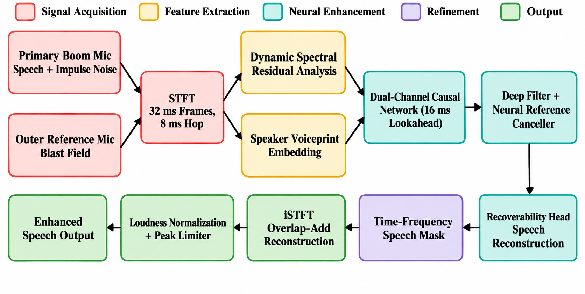

<div align="center">

# 🎧 AURA — Voice-Preserving Blast Suppression

**Removes gunshots and explosions from a soldier's headset while keeping the voice, even when both happen at once.**


**Team AURA@VCET** (Team ID 152043) · Velammal College of Engineering & Technology, Madurai

</div>

---

## 🎬 Videos

**Video 1 – Problem & Audio Demonstration**
Animated explanation of the problem statement, proposed concept, and input/output audio demonstration.
▶️ https://youtu.be/VIDEO_1_ID

**Video 2 – Complete Framework & Validation**
Detailed framework explanation, ablation study, experimental results, and Blender-based prototype model.
▶️ https://youtu.be/VIDEO_2_ID

<!-- Replace VIDEO_1_ID and VIDEO_2_ID with your YouTube video ids. -->

---

## 📌 Problem statement

| | |
|---|---|
| **Problem Statement ID** | SIH26052 |
| **Title** | AI/ML-enabled adaptive noise cancellation (ANC) that suppresses stationary, non-stationary and impulsive defence noises while keeping speech intelligible, in real time on embedded hardware |
| **Theme / Category** | Miscellaneous / Hardware |

In combat, gunfire and blasts drown out radio speech, and a missed command can cost lives. Ordinary noise-cancelling
headsets cut loud sounds **and the voice with them**. The hardest case is overlap: a blast and a word at the same instant.

## 💡 Proposed solution

A smart **two-microphone headset** with an on-device AI:

* 🎙️ The **boom mic** hears the voice plus the blast; the **outer reference mic** hears mostly the blast.
* 🧠 A **causal dual-channel network** separates voice from blast every 8 ms, even when they overlap.
* 🗂️ It learns from **voice and noise pools** (recorded voices, LibriSpeech, gunshots from many weapons, explosions) and **voice / noise dictionaries**.
* 🧬 **DSRA** (Dynamic Spectral Residual Analysis) cues and a **speaker voiceprint** tell it whose voice to protect.
* 🔈 The output is loudness-normalised for clear, steady speech, and everything runs **on the device**: no cloud, no network link.

## ⚙️ Framework (MARK7-DM)

<div align="center"></div>

| # | Block | What it does |
|---|---|---|
| 1 | Two microphones | Boom mic (voice + blast), outer reference mic (blast field) |
| 2 | STFT | 32 ms frames every 8 ms, both mics |
| 3 | DSRA cues | 8 per-frame spectral descriptors per mic |
| 4 | Speaker voiceprint | Identifies the wearer from blast-free voice frames |
| 5 | Dual-channel causal network | 16 ms lookahead; deep filter, neural reference canceller, recoverability head |
| 6 | Speech mask / post-filter | Removes residual blast energy using the reference mic |
| 7 | iSTFT + loudness | Overlap-add, −18 LUFS normalisation, peak limiter |

Details: [`docs/ARCHITECTURE.md`](docs/ARCHITECTURE.md)

## 📊 Ablation study

**Targets (fixed):** SNR > 15 dB · STOI > 0.85 · PESQ > 2.5.
AURA compared with state-of-the-art speech-enhancement frameworks on our dataset
(full report: [`docs/Ablation_Study_AURA_VCET.docx`](docs/Ablation_Study_AURA_VCET.docx) · [`docs/ABLATION_STUDY.md`](docs/ABLATION_STUDY.md)).

| Framework | Output SNR (dB) | Output STOI | Output PESQ | Δ SI-SDR (dB) | All 3 targets |
|---|---|---|---|---|---|
| BSRNN Large (non-causal) | 17.495 | 0.9857 | 3.1139 | 13.482 | ✅ PASS |
| TF-GridNet | 4.993 | 0.8643 | 1.3011 | 4.557 | ❌ FAIL |
| μNet / U-Net (dataset-adapted) | 0.806 | 0.5156 | 1.1123 | −0.166 | ❌ FAIL |
| GTCRN | −4.159 | 0.3515 | 1.0632 | −13.134 | ❌ FAIL |
| DeepFilterNet3 | 0.272 | 0.7742 | 1.2265 | 4.855 | ❌ FAIL |
| **Proposed AURA (causal, real-time)** | **18.106** | **0.9888** | **2.8670** | **17.001** | ✅ **PASS** |

AURA meets all three targets while staying **causal and real-time**; the only other framework that passes (BSRNN Large)
is non-causal, so it cannot run live on a headset.

### Component ablation (reproducible with this repository)
Mean over 60 field clips (team voices, unseen gunshots / explosions). Cells: SNR (dB) / STOI / PESQ, and the share of clips that pass all three targets.

| Configuration | SNR / STOI / PESQ | Pass all 3 |
|---|---|---|
| Noisy input | 8.0 / 0.908 / 1.83 | 8 % |
| MARK7 (single mic) | 10.5 / 0.916 / 2.10 | 10 % |
| + reference mic, lookahead, voiceprint (MARK7-DM v2) | 12.8 / 0.941 / 2.48 | 25 % |
| + DSRA cues (MARK7-DM v3) | 13.0 / 0.944 / 2.53 | 30 % |
| **Hardware scenario: MARK7-DM v4** (raw boom mic + close reference mic) | **15.8 / 0.956 / 2.64** | **47 %** |

Each block improves the result, and intelligibility (STOI) stays above 0.85 throughout. See [`docs/EVALUATION.md`](docs/EVALUATION.md).

## 🛠️ Hardware

<div align="center"></div>

| Component | Role |
|---|---|
| Milk-V Duo 256M | Real-time DSP and edge-AI inference |
| WM8960 audio codec | Synchronised dual-mic capture and headphone output |
| Boom microphone | Clear close-talk voice pickup |
| High-AOP MEMS reference mic | Captures blasts without clipping |
| 32 Ω drivers in passive earmuffs | Enhanced audio with hearing protection |
| Li-ion battery + TP4056 (DW01) | Portable power with safe charging |
| MT3608 boost converter | Stable 5 V supply for the Duo |
| 3.3 V LDO regulator | Clean power for mics and codec |
| MicroSD card | OS, model weights and recordings |
| Linux + ALSA + NPU SDK | Real-time audio I/O and AI inference |

Details: [`docs/HARDWARE.md`](docs/HARDWARE.md)

## 🚀 Quick start

### Google Colab (full pipeline)
1. Upload the datasets to Google Drive (layout in [`DATASETS.txt`](DATASETS.txt)).
2. Put this repository folder (or its zip) in `MyDrive/SIH`.
3. Open **`AURA_SIH26052.ipynb`**, check the CONFIG cell, then **Run all**.

| Stage | What it does |
|---|---|
| 0 | Setup, data links, LibriSpeech dev-clean download |
| A | Build the two-mic evaluation corpora |
| B | *(optional, off)* Train MARK7-DM → v2 → v3 |
| C | Evaluate MARK7 1-mic / v2 / v3 |
| D | Evaluate MARK7-DM v4 in the hardware scenario |
| E | Demo audio sets + pipeline diagram + results zip |
| F | 5 PASS + 5 FAIL cases, each a different signal |

Every stage prints a `MILESTONE`. `QUICK = True` gives a ~10-minute check run.

### Your own recording (command line)
```bash
pip install -r requirements.txt
python infer.py --voice boom_mic.wav --ref reference_mic.wav --out clean.wav     # two mics
python infer.py --voice boom_mic.wav --out clean.wav                             # one mic
```

## 📁 Repository layout
```
AURA_SIH26052.ipynb   Colab notebook: full pipeline (stages 0, A–F)
infer.py              command-line inference on your own .wav files
DATASETS.txt          where to put the datasets (not included)
code/                 corpus building, training, evaluation, demo sets
code/aura/            models, DSRA, dual-mic simulator, post-filter, metrics, loudness
mark7_bundle/         MARK7 runtime + blast library
weights/              trained weights
docs/                 architecture, hardware, evaluation, ablation study, diagrams
```

## 📦 Datasets
Not included; see [`DATASETS.txt`](DATASETS.txt): voice recordings, gunshot folders (one per weapon) and explosion `.wav` files.
LibriSpeech is downloaded by the notebook.

## 👥 Team AURA@VCET

| Role | Name | Stream | Year |
|---|---|---|---|
| Team Leader | Medwin Manuel S | ECE | 3rd Year (2026–27) |
| Team Member | Sanjay Babu K S | ECE | 3rd Year (2026–27) |
| Team Member | Akil Radheswar S | ECE | 3rd Year (2026–27) |
| Team Member | Udhaya Prajjan S | ECE | 3rd Year (2026–27) |
| Team Member | Dharshini S | ECE | 3rd Year (2026–27) |
| Team Member | Shivani K | ECE | 3rd Year (2026–27) |

Velammal College of Engineering & Technology (VCET), Madurai.

## 📚 References
1. CDC / NIOSH, *How Can We Measure Impulse Noise Properly?*, NIOSH Science Bulletin, 2018. https://www.cdc.gov/niosh/bulletin/2018/impulse-noise.html
2. C. H. Taal et al., *An Algorithm for Intelligibility Prediction of Time–Frequency Weighted Noisy Speech* (STOI), IEEE TASLP, 2011. https://doi.org/10.1109/TASL.2011.2114881
3. ITU-T Recommendation P.862, *Perceptual Evaluation of Speech Quality (PESQ)*. https://www.itu.int/rec/T-REC-P.862
4. H. Schröter et al., *DeepFilterNet: A Low Complexity Speech Enhancement Framework for Full-Band Audio Based on Deep Filtering*, IEEE ICASSP, 2022. https://doi.org/10.1109/ICASSP43922.2022.9747055

## 📄 License
Copyright © 2026 Team AURA@VCET. All rights reserved. See [`LICENSE`](LICENSE).
