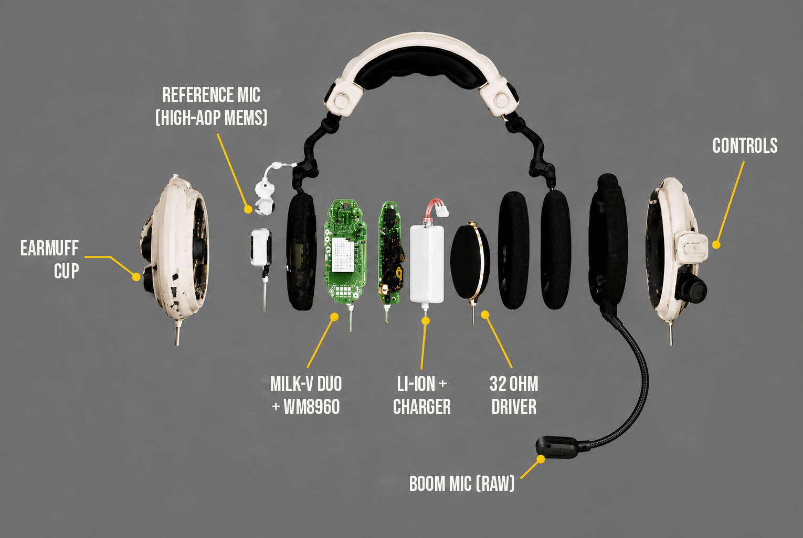

# 🎧 Hardware — AURA headset



| Component | Role |
|---|---|
| **Milk-V Duo 256M** | Real-time DSP and edge-AI inference (RISC-V + NPU, Linux) |
| **WM8960 audio codec** | Synchronised dual-mic capture and headphone output |
| **Boom microphone** | Clear close-talk voice pickup (read raw; gain applied after cleaning) |
| **High-AOP MEMS reference mic** | Outer ear-cup mic that captures blasts without clipping |
| **32 Ω drivers in passive earmuffs** | Enhanced audio with passive hearing protection |
| **Li-ion battery + TP4056 (DW01)** | Portable power with safe charging and cell protection |
| **MT3608 boost converter** | Stable 5 V supply for the Duo |
| **3.3 V LDO regulator** | Clean, low-noise power for the mics and codec |
| **MicroSD card** | OS, model weights and recordings |
| **Linux + ALSA + NPU SDK** | Real-time audio I/O and AI inference |

## Signal path

```
boom mic ─┐                      ┌─> STFT ─> DSRA cues + voiceprint ─> MARK7-DM network ─┐
          ├─> WM8960 (I2S) ─> Duo┤                                                        ├─> canceller + mask ─> iSTFT ─> loudness ─> WM8960 ─> 32 Ω drivers
ref mic  ─┘                      └─> STFT (reference channel) ────────────────────────────┘
```

Frame size 32 ms, hop 8 ms, lookahead 16 ms. Both mics must be sampled by the same codec clock
(the WM8960 records them as one stereo stream), so the two channels stay sample-aligned.
